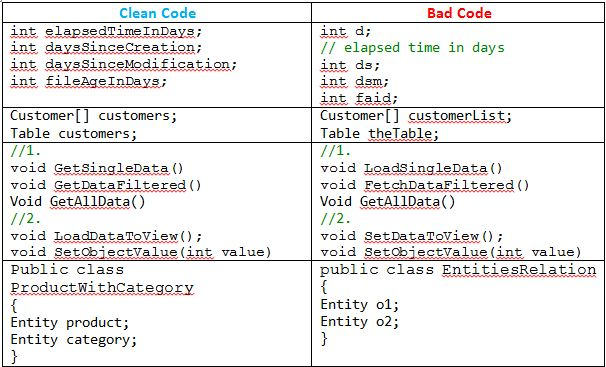

# Belajar Clean Code

Untuk dapat mengatakan bahwa sebuah sofware sudah memenuhi syarat _Clean Code_, terdapat beberapa kriteria yang harus diperhatikan yaitu :

1. Coupling Rendah – code ditulisan dengan coupling yang serendah mungkin sehingga jika terjadi kesalahan, hanya bagian yang salah saja yang harus diperbaiki. Jika diumpamakan dalam kehidupan sehari-hari, hubungan antara baterai denga iphone adalah hubungan dengan coupling yang tinggi karena saat baterai iphone rusak maka seluruh handphone harus diganti. Sedangkan pada handphone nokia, couplingnya rendah karena jika baterainya rusak, kita cukup mengganti baterainya saja.
2. Tinggi Cohhesion – kohesi yang tinggi membuat di dalam class dan komponen membuat code menjadi lebih simple, struktur code jadi lebih mudah dipahami.
3. Class-class kecil – Jangan membuat class atau fungsi yang terlalu panjang sehingga tujuan atau fungsi dari class tersebut menjadi lebih jelas. Dan semakin panajng atau besar sebuah class akan semakin meningkat kemungkinan adanya bugs.
4. DRY (Don’t Repeat Yourself) – hindari duplikasi. Jangan mengulangi class atau fungsi yang sama di dalam sebuah code.
5. Nama yang sesuai – berikan nama untuk class, fungsi, dan variabel sesuai dengan fungsinya.
6. Konsisten – mengikuti aturan yang sudah ditetapkan. Contohnya jika ditentukan bawah jika class terdiri dari lebih satu kata, maka nama class harus dipisahkan dengan \_ antara katanya. Maka di semua code harus mengikuti aturan ini.
7. Tanpa komentar – buatlah code sejelas mungkin sehingga tanpa menggunakan comment fungsi dari class terebut sudah dapat diketahui. Tujuan lain adalah untuk menghindari kebingungan antara comment dan isi code. Sering terjadi saat code diubah namun comment yang menjelaskan code tersebut tidak ikut diubah sehingga menimbulkan kebingungan bagi yang membaca code tersebut.

## References

- https://www.howtoforge.com/how-to-install-sonarqube-on-ubuntu-1804/
- https://blog.cleancoder.com/uncle-bob/2012/08/13/the-clean-architecture.html
